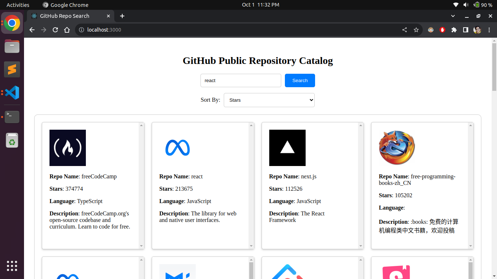

# dice-task1

# About
This is a short assignment basically designing frontend in Reactjs.

Fetch and display list of GitHub public repositories,
using the GitHub API
 https://developer.github.com/v3/search/

# Technologies Used
React.js

# Getting Started
1. Clone the repository to local machine:
git clone https://github.com/akram-teachmint/dice-task1.git

Navigate to the project directory:
cd dice

Install the required dependencies:
npm install

Start the development server:
npm start

Open web browser and access the application at http://localhost:3000.

# Screenshot
